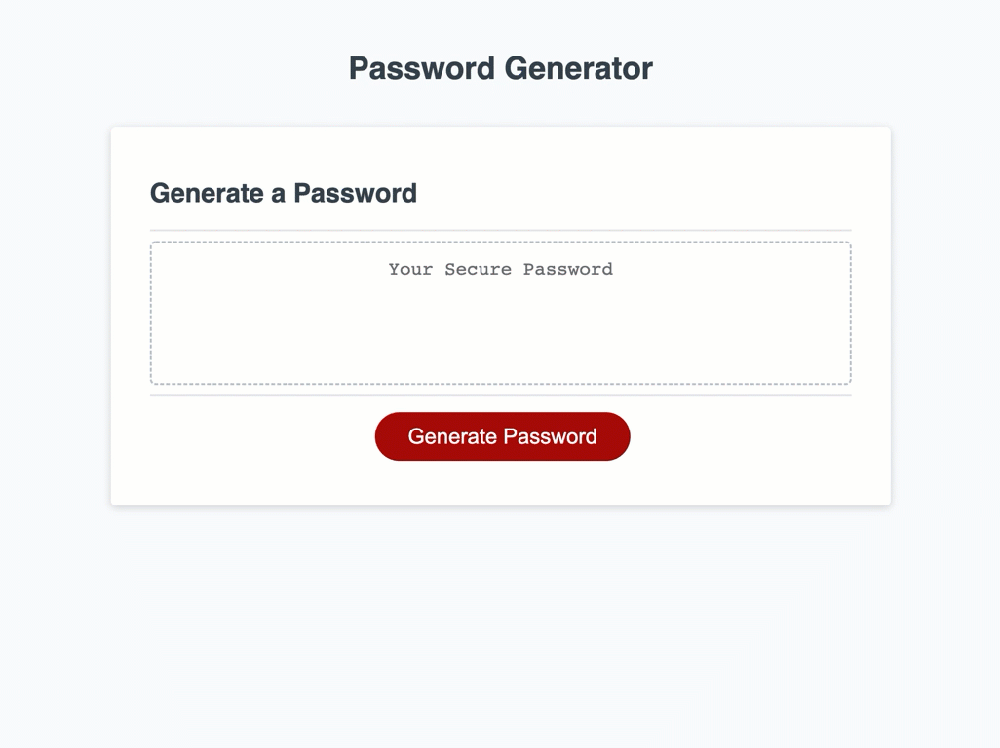

# Password Generator

## Purpose
To create passwords of between 8 and 128 characters that include different criteria if user chooses to use that criteria 

## Criteria

User is asked whether or not to include lowercase, uppercase, numeric, and/or special characters with different prompts for each item

## Built with 
* HTML
* CSS
* JavaScript

## Website
https://jleitz27.github.io/password-generator/

##

  

## Contribution
Made by Jason Leitz